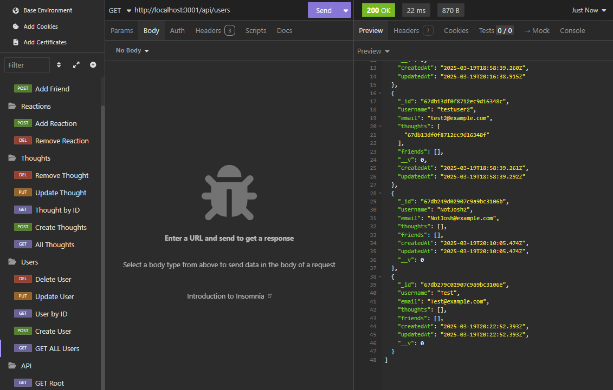

# 📱 JoshsSoNet – Social Network API

## 🚀 Description
JoshsSoNet is a fully functional social network API built with **Express**, **MongoDB**, and **Mongoose**. Users can:
- Create, read, update, and delete users
- Post thoughts and reactions
- Add or remove friends
- Test everything in **Insomnia**
- Seed the database easily

## 🛠 Technologies
- Node.js
- Express.js
- MongoDB / Mongoose
- TypeScript
- dotenv
- Insomnia (for testing)

## 📂 Installation
```bash
git clone https://github.com/joshsdesk/JoshsSoNet
cd JoshsSoNet
npm install
```

## 🔥 Running the App (Dev Mode)
```bash
npm run dev
```

## 🌱 Seed the Database
```bash
npm run build
npm run seed
```

## ✅ API Routes (Test in Insomnia)
### Users
- GET /api/users
- POST /api/users
- GET /api/users/:id
- PUT /api/users/:id
- DELETE /api/users/:id
- POST /api/users/:userId/friends/:friendId
- DELETE /api/users/:userId/friends/:friendId

### Thoughts
- GET /api/thoughts
- POST /api/thoughts
- GET /api/thoughts/:id
- PUT /api/thoughts/:id
- DELETE /api/thoughts/:id
- POST /api/thoughts/:thoughtId/reactions
- DELETE /api/thoughts/:thoughtId/reactions/:reactionId

## API Routes Tested in Insomnia

### 📥 Create User


### 📤 Get All Users


### 💬 Create Thought


### 💬 Add Reaction


### 👥 Add Friend


### ✅ Server Running

## ⚠️ Notes
- `.env` contains Mongo URI
- `node_modules` and `dist` excluded via `.gitignore`

## ✨ Future Improvements
- JWT auth layer
- Pagination
- Friend suggestions

## 👨‍💻 Author
[Walk-Through](https://youtu.be/AJ9TvgDVI84)

[Github Repo](https://github.com/joshsdesk/JoshsSoNet)
